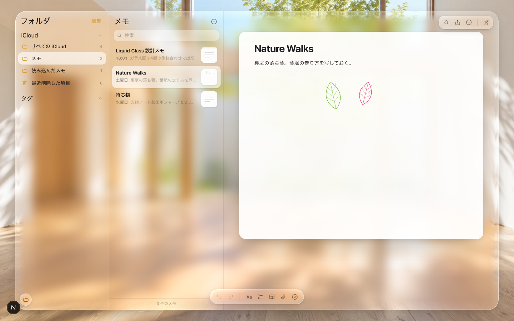

# Liquid Glass Notes

Apple が iPadOS / macOS で採用する **Liquid Glass** の質感を、Web 標準だけで再現したメモアプリ。



## 何をしているか

ガラス面を6層の重ね合わせで作る。

| 層 | 役割 |
|---|---|
| frost | 背景のぼかしと彩度上昇 |
| rim | **縁での屈折** — SVG 変位マップで光路を曲げる |
| tint | 材質の明暗を決める半透明の塗り |
| sheen | 斜めに走る艶 |
| edge | 1px の縁光 |
| content | 中身 |

ぼかしだけでは板ガラスにならない。縁で背景の像が圧縮・湾曲して初めてガラスに見える。その屈折を角丸長方形の符号付き距離場から変位マップを起こして作っている。

## 対応状況

| ブラウザ | ぼかし | 縁の屈折 |
|---|---|---|
| Chrome / Edge | ○ | ○ |
| Safari | ○ | ×（自動で frost のみに退避） |
| Firefox | ○ | × |

Safari は `backdrop-filter` に SVG フィルタを渡すと、ぼかしごと無効になる。そのため Chromium と積極判定できた時だけ屈折を有効にしている。

## 機能

- フォルダとメモの作成・改名・削除・復元
- リッチテキスト、チェックリスト、表、画像添付
- 手書き（ペン／マーカー／鉛筆／消しゴム、色6種、太さ可変）
- 検索、並べ替え、タグ、ピン留め
- 取り消し／やり直し（⌘Z / ⇧⌘Z）
- 端末内保存、Markdown 書き出し、印刷
- 背景の明るさに応じた材質の自動切替

## 使い方

```bash
npm install
npm run dev
```

http://localhost:3000

## 注意

macOS の「システム設定 › アクセシビリティ › ディスプレイ › 透明度を下げる」が有効だと、通常の Web ページのガラス表現は消える。本アプリは材質そのものが主題のため既定では従わない。右上のしずくボタンから「OS の透明度設定に従う」で切り替えられる。

## 文書

`docs/INDEX.md` を入口とする。設計判断は `docs/decisions/` の ADR に記録している。
